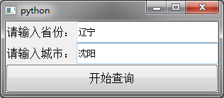
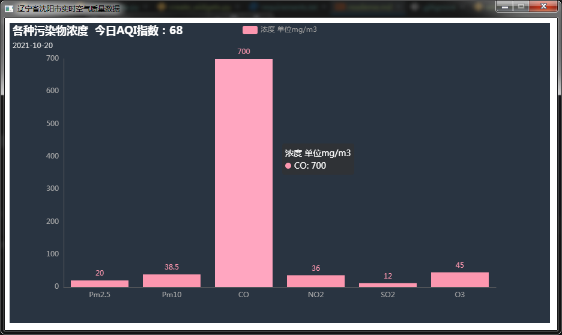
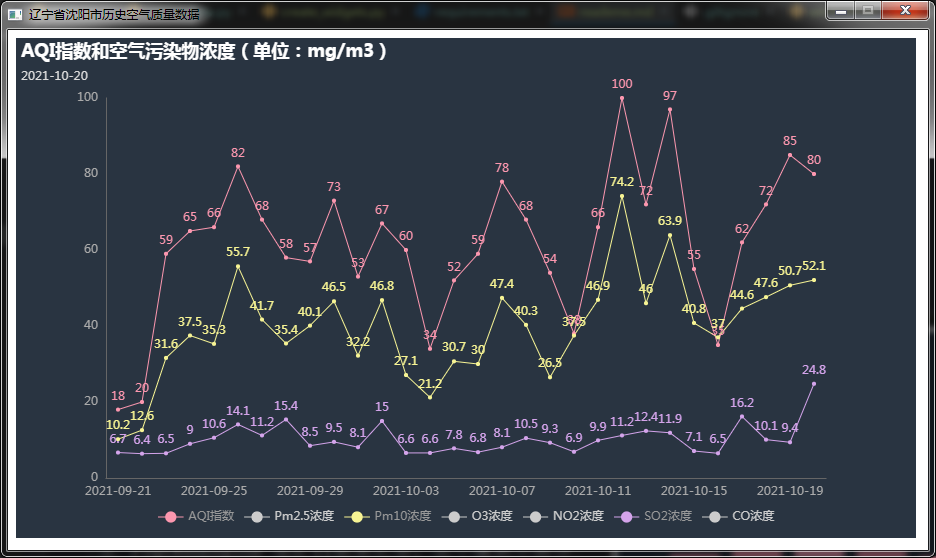

# 天气查询系统

## 运行环境搭建
```shell
# 准备代码以及需要的包
conda create -n weather
git clole https://github.com/jyjdal/weather.git
cd weather
conda activate weather
pip install -r requirements.txt
```
```shell
# 运行项目
python main.py
```

## 运行效果




其中历史天气数据可以通过点击图表下方的`图例`来切换显示不同种类的污染物浓度。

## 需要的依赖
用到的依赖版本参见`requirements.txt`，这里对各个模块的作用进行简单说明：
1. requests 用于通过第三方天气API从网络获取数据。
2. pypinyin 将省份和城市名称从汉字转换成API需要的拼音。
3. pyecharts 用于获取到数据后绘制可视化图表。
4. PyQt5 用于图形界面的构建。
5. PyQtWebEngine 在5.11版本之后，这个模块不再作为PyQt5的内置模块提供，`需要手动下载`。用于在PyQt应用程序中嵌入html网页。

## 各个模块的作用
1. network 用于从第三方API获取数据，其中`prepare.py`用于获取全国省市名称，便于查找无法通过直接转换成拼音得到城市名的城市。
2. ui 用于构建图形界面，用户按下查询按钮后的主要逻辑实现也在这个包下。
3. utils/process_region.py 将省市名称从汉字转换成第三方API可以识别的格式（大多数直接转换成拼音即可）。
4. visualize/visualize.py 将获取到的实时空气数据和历史空气数据渲染成图表。
